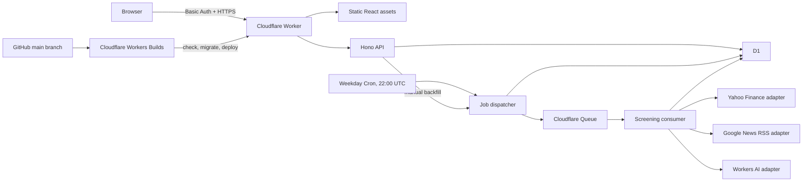

# Stock Movement Explainer — Design Specification

Status: Approved for implementation planning  
Date: 2026-07-09

## 1. Summary

Build a password-protected, mobile-first personal dashboard for a watchlist of 25–100 US and Canadian stock and ETF symbols. After the regular trading session, the application calculates each symbol's adjusted close-to-close movement. Symbols that move at least 5.00% in either direction receive a report containing their movement, a concise Simplified Chinese explanation of the likely catalyst, a confidence level, and links to supporting English-language news sources.

The application retains report history and permits manual backfills of up to 30 calendar days. It is designed to remain within Cloudflare's free tiers and uses unofficial public market/news feeds with explicit failure handling and replaceable adapters.

## 2. Goals

- Maintain a watchlist of US and Canadian listings from the website.
- Screen the watchlist automatically after each weekday's regular session.
- Flag raw adjusted close-to-close changes whose absolute value is at least 5.00%.
- Generate concise Simplified Chinese explanations grounded only in retrieved English news metadata.
- Show confidence and clickable supporting sources when available, or an explicit no-relevant-sources state.
- State clearly when no well-supported catalyst can be found.
- Keep a browsable history of published daily reports.
- Allow protected manual backfills covering at most 30 calendar days per request.
- Work well on phones and desktop browsers.
- Deploy automatically from GitHub after successful checks.
- Avoid paid usage by failing or pausing safely when a free quota is reached.

## 3. Non-goals

- Multiple users, account registration, roles, or per-user watchlists.
- Real-time, intraday, pre-market, or after-hours alerts.
- Email, SMS, or push notifications.
- Trading, brokerage integration, portfolio accounting, or investment advice.
- Global exchanges outside supported US and Canadian Yahoo Finance symbols.
- Guaranteed exchange-grade prices or licensed news feeds.
- Full article scraping, archiving, or reproducing copyrighted article bodies.
- Sentiment scoring, forecasts, or recommendations to buy or sell.

## 4. Constraints and assumptions

- The site has one shared HTTP Basic Authentication username and password; there is no user database.
- The watchlist is capped at 100 active symbols.
- Canadian Yahoo symbols use suffixes such as `.TO` for Toronto Stock Exchange and `.V` for TSX Venture. Symbols are validated before insertion rather than accepted from an exchange allowlist.
- Market prices come from Yahoo Finance's unofficial chart endpoint. English news metadata comes from Google News RSS. Either feed may change without notice.
- Price calculations use adjusted daily closes when available. The application never substitutes the current quote for a missing completed daily bar.
- The scheduled report is dashboard-only. No notification channel is included.
- English UI copy is used throughout; generated explanations are in Simplified Chinese.
- Cloudflare's current free-tier policies may change. The application has no paid-tier fallback.

## 5. Technology and deployment shape

- Language: TypeScript.
- Frontend: React built with Vite, using a small custom responsive design system rather than a large component library.
- HTTP/API layer: Hono running in one Cloudflare Worker.
- Persistence: Cloudflare D1 with versioned SQL migrations.
- Scheduling: one Cloudflare Cron Trigger.
- Background work: Cloudflare Queues.
- LLM: Cloudflare Workers AI through an AI binding.
- Validation: schema validation for HTTP inputs, provider results, and LLM output.
- Tests: Vitest for unit/integration coverage and Playwright for responsive browser flows.
- Hosting: Worker static assets and API routes from the same deployment and origin.

The Worker must run before static assets so Basic Authentication protects both API and frontend files.

## 6. Architecture

One Worker package owns HTTP routes, scheduled dispatch, and queue consumption. Internally, provider and domain boundaries remain separate so unofficial feeds can be replaced without changing screening or UI behavior.

## 7. Component boundaries

### 7.1 Authentication

- Intercepts every frontend and API request.
- Reads username and password only from Cloudflare secrets.
- Returns `401` with a Basic Auth challenge for missing or invalid credentials.
- Uses HTTPS and a timing-safe comparison where the runtime permits it.
- Does not log credentials or authorization headers.

### 7.2 Watchlist service

- Normalizes symbols to uppercase and trims whitespace.
- Validates a proposed symbol by retrieving provider metadata and a recent daily bar.
- Stores the provider's canonical symbol, company name, exchange, currency, and active state.
- Rejects duplicates, unsupported instruments, invalid symbols, and additions above 100 active symbols.
- Supports disabling/removing a symbol without deleting its historical reports.

### 7.3 Market-data adapter

- Retrieves a date range containing the requested trading date and the preceding completed trading bar.
- Exposes normalized daily bars independent of Yahoo's response schema.
- Uses adjusted close when present; otherwise it may use close only when no split/dividend adjustment is indicated, and records which basis was used.
- Treats absent, null, future, or stale bars as missing data.
- Provides company/exchange/currency metadata used during symbol validation.

### 7.4 News adapter

- Searches using both canonical ticker and company name.
- Requests English results and filters publication timestamps locally.
- Uses a window beginning after the previous session's close and ending two hours after the target session's close. Historical RSS queries use enclosing calendar-date operators and then apply this precise local filter.
- Deduplicates normalized URLs and materially identical headlines.
- Prefers recent results and publisher diversity.
- Returns at most 10 items containing title, publisher, publication time, URL, and feed description when present.
- Does not fetch or store full article bodies.

### 7.5 Explanation service

- Treats all news fields as untrusted quoted data, never as model instructions.
- Uses at most one model call per qualifying ticker/report generation.
- Requests structured JSON containing:
  - `explanation_zh_cn`: two to four concise Simplified Chinese sentences;
  - `confidence`: `high`, `medium`, or `low`;
  - `clear_catalyst`: boolean;
  - `source_indexes`: unique indices into the supplied news list.
- Allows an empty `source_indexes` list only when `clear_catalyst` is false.
- Requires the model to avoid causal certainty and investment advice.
- Requires a low-confidence, explicit no-clear-catalyst explanation when evidence is absent, contradictory, stale, or merely sector-wide.
- If the news adapter returns zero results, returns a deterministic Simplified Chinese no-sources explanation without spending an LLM call.
- Rejects invalid JSON, unknown source indices, empty explanations, or outputs outside the schema.

### 7.6 Screening service

- Selects the target date's completed bar and the immediately preceding completed bar for that symbol.
- Calculates `change_pct = ((current_adjusted_close / previous_adjusted_close) - 1) * 100` using unrounded values.
- Qualifies a symbol when `abs(change_pct) >= 5.00` before display rounding.
- Stores the price result even when news or AI processing fails.
- Calls the news and explanation services only for qualifying symbols.

### 7.7 Job service

- Creates scheduled runs, manual backfill jobs, report generations, and ticker screening rows.
- Dispatches idempotent messages containing report-generation ID and ticker ID; it does not rely on mutable watchlist state during consumption.
- Applies a daily soft dispatch ceiling of 2,500 ticker messages, leaving free-tier room for retries.
- Retries transient provider errors at most three times with backoff.
- Records a terminal per-ticker failure after the last attempt so a run can finish.
- Resumes undispatched D1 work on later dispatcher invocations instead of exceeding the soft ceiling.

### 7.8 Report service

- Reads the latest published generation per trading date.
- Returns progress counts while a run is processing.
- Returns completed movers even when other ticker jobs fail.
- Publishes a replacement generation atomically after reprocessing completes.

## 8. Data model

### `tickers`

- `id`
- `symbol` (unique canonical provider symbol)
- `company_name`
- `exchange`
- `currency`
- `active`
- `deleted_at` (nullable; removal is a soft delete)
- `created_at`, `updated_at`

### `backfill_jobs`

- `id`
- `start_date`, `end_date`
- `reprocess_existing`
- `status`: `pending`, `running`, `complete`, `complete_with_errors`, `paused`
- `dates_total`, `dates_processed`, `ticker_jobs_total`, `ticker_jobs_processed`, `ticker_jobs_failed`
- `created_at`, `started_at`, `completed_at`

### `report_runs`

- `id`
- `trading_date`
- `generation`
- `origin`: `scheduled` or `backfill`
- `backfill_job_id` (nullable)
- `published`
- `status`: `pending`, `running`, `complete`, `complete_with_errors`, `no_market_data`
- `tickers_total`, `tickers_processed`, `tickers_qualified`, `tickers_failed`
- `created_at`, `started_at`, `completed_at`
- Unique key on `(trading_date, generation)` and a partial unique index enforcing at most one published generation per date.

### `screenings`

- `id`
- `report_run_id`, `ticker_id`
- Snapshot fields: `symbol`, `company_name`, `exchange`, `currency`
- `target_date`, `previous_bar_date`
- `previous_adjusted_close`, `current_adjusted_close`
- `change_amount`, `change_pct`
- `price_basis`: `adjusted` or `close`
- `qualified`
- `status`: `pending`, `queued`, `processing`, `complete`, `no_trading_data`, `failed`
- `attempt_count`, `queued_at`, `processing_started_at`, `error_code`, `error_message`
- Unique key on `(report_run_id, ticker_id)`.

### `analyses`

- `id`, `screening_id` (unique)
- `explanation_zh_cn`
- `confidence`
- `clear_catalyst`
- `model`
- `status`: `complete` or `unavailable`
- `created_at`

### `sources`

- `id`, `screening_id`
- `source_index`
- `title`, `publisher`, `published_at`, `url`
- `cited`
- Unique key on `(screening_id, source_index)`.

Historical screening snapshots remain readable after a ticker is disabled or removed.

## 9. Scheduled daily workflow

1. Cron runs Monday through Friday at 22:00 UTC, which is 5 p.m. EST or 6 p.m. EDT and therefore after US and Canadian regular sessions.
2. The dispatcher creates at most one scheduled generation for that UTC/trading date.
3. It snapshots all active tickers into screening rows, then sends queue messages in batches.
4. Each consumer retrieves the requested date's bar and the prior completed bar.
5. If the target bar is absent, that ticker is marked `no_trading_data`; exchange holidays therefore do not produce 0% records or false movers.
6. The consumer calculates movement and stops for non-qualifying symbols.
7. For a qualifying symbol, it retrieves and deduplicates news, invokes Workers AI, validates the structured result, and stores the analysis and sources.
8. After each batch, the job service updates progress. When no screening is pending, queued, or processing, it sets the run to `complete` or `complete_with_errors`.
9. If no ticker has a completed target-date bar, the run becomes `no_market_data` and is not published. This prevents empty reports on full-market holidays.
10. Otherwise, the completed generation becomes the published report for that date.

Queue messages and database writes are idempotent. A duplicate Cron event, redelivery, or concurrent finalization attempt cannot create a duplicate published result.

## 10. Manual backfill workflow

- The user selects inclusive start and end dates and may enable `reprocess existing reports`.
- The API rejects future dates, reversed ranges, and ranges longer than 30 calendar days.
- The job snapshots the active watchlist at creation time. Later watchlist edits do not change an in-progress backfill.
- Weekend dates are excluded before report creation. Exchange-specific holidays are identified per ticker from absent market bars.
- Existing published dates are skipped by default.
- Reprocessing creates a new unpublished generation. The old published generation remains visible until the replacement finishes, after which publication switches atomically. A failed replacement does not erase the old report.
- The dashboard polls job status and shows date/ticker progress and errors. Processing continues if the browser closes.
- A 30-calendar-day range contains at most about 22 weekdays. With 100 tickers plus the normal daily run, nominal queue use is about 2,300 messages or 6,900 queue operations. The 2,500-message soft dispatch ceiling preserves room for retries.
- Any work above the daily dispatch ceiling remains in D1 and resumes later; it never opts into paid overage.

## 11. HTTP API

All routes require Basic Authentication.

- `GET /api/reports/latest` — latest published report plus any current run progress.
- `GET /api/reports?cursor=...` — reverse-chronological report summaries.
- `GET /api/reports/:date` — published report for one date.
- `GET /api/tickers` — watchlist.
- `POST /api/tickers` — validate and add a symbol.
- `PATCH /api/tickers/:id` — enable or disable a symbol.
- `DELETE /api/tickers/:id` — soft-delete it from the watchlist while preserving history.
- `POST /api/backfills` — create a validated backfill request.
- `GET /api/backfills/:id` — job progress and errors.
- `POST /api/screenings/:id/retry` — retry news/analysis for an existing qualifying price result.

Mutation routes validate JSON content type, body size, field types, and bounds. Errors use stable machine codes plus safe user-facing messages.

## 12. User interface

The approved direction is a calm, light report feed. Explanations take visual priority over dense quote data.

### Today

- Shows report date, run state, tracked count, qualified count, and error count.
- Displays mover cards ordered by descending absolute movement, with ticker as a stable tie-breaker.
- Each card shows company/exchange/currency, closing price, absolute and percentage movement, direction icon, Simplified Chinese explanation, confidence, and expandable English sources when available.
- Red/green is supplemented by signs, arrows, and text.
- “No clear catalyst found,” “No relevant sources found,” and “Explanation unavailable” are distinct states.

### History

- Shows report dates in reverse chronological order.
- Opens a date using the same mover-card layout as Today.
- Makes partial-error status visible without hiding successful cards.

### Watchlist

- Offers one symbol input with examples such as `AAPL`, `SHOP.TO`, and `WELL.V`.
- Validates before saving and displays resolved company, exchange, and currency.
- Lists active and disabled symbols with enable, disable, and remove controls.

### Backfill

- Provides start/end date controls, the 30-day constraint, and a reprocess switch.
- Shows job progress, queued/processed/failed counts, per-date outcomes, and retryable errors.

### Responsive behavior

- Under the mobile breakpoint: one-column cards, compact header, and bottom navigation for Today, History, Watchlist, and Backfill.
- At wider widths: top navigation, a constrained reading width, and a two-column mover-card grid.
- Touch targets are at least 44 CSS pixels; text remains usable without zoom; keyboard focus is visible; semantic headings and labels are present.

## 13. Failure handling

- Timeouts, `429`, and provider `5xx` responses are transient and retryable.
- Invalid symbols, missing historical bars, and schema mismatches are terminal for that ticker attempt.
- Market-data failure leaves the screening failed because movement cannot be established.
- News failure preserves the qualifying movement and produces an unavailable/no-supported-catalyst state rather than inventing a reason.
- LLM failure preserves movement and retrieved sources and exposes a targeted retry action.
- One ticker failure never fails unrelated ticker jobs.
- Run and backfill statuses distinguish success from `complete_with_errors`.
- Error messages stored in D1 are sanitized and bounded in length.
- Before each dispatch, stale `queued` or `processing` leases are reset to `pending`. This recovers work if a free-tier queue message expires or a consumer terminates before recording an outcome.

## 14. Cost controls

As of 2026-07-09, the relevant published free allocations are:

- Workers: 100,000 requests per day and up to five Cron Triggers on the free plan.
- D1: 5 million rows read/day, 100,000 rows written/day, and 5 GB total storage.
- Queues: 10,000 operations/day; a successful message normally costs one write, one read, and one delete.
- Workers AI: 10,000 neurons/day.

References:

- <https://developers.cloudflare.com/workers/platform/limits/>
- <https://developers.cloudflare.com/d1/platform/pricing/>
- <https://developers.cloudflare.com/queues/platform/pricing/>
- <https://developers.cloudflare.com/workers-ai/platform/pricing/>

The application caps active tickers, backfill duration, daily dispatch, news items, and LLM tokens. It uses one LLM call only for qualifying movers. It does not configure paid fallback or automatic plan upgrades. Quota-related errors pause or fail work visibly.

## 15. Security and data handling

- Secrets are configured in Cloudflare, never committed to Git.
- All site and API traffic requires Basic Auth over HTTPS.
- Authorization headers and provider payloads are excluded from application logs.
- External news fields are escaped in HTML and isolated as untrusted LLM data.
- Source links open safely with appropriate `rel` attributes.
- The application stores price points, explanations, and news metadata/headlines, not article bodies.
- This is a personal research aid and displays a short “not investment advice” footer.

## 16. Testing strategy

### Unit tests

- Thresholds at `+5.00%`, `-5.00%`, and values immediately inside/outside the boundary.
- Unrounded calculation versus rounded display values.
- Adjusted-close selection, split scenarios, null bars, and stale dates.
- US, `.TO`, and `.V` normalization/validation fixtures.
- News time-window filtering, publisher diversity, URL/headline deduplication, and irrelevant results.
- LLM schema validation, Simplified Chinese output checks, source index validation, and no-clear-catalyst behavior.
- Authentication parsing and safe error mapping.

### Integration tests

- Hono routes against local D1 migrations.
- Scheduled dispatch and queue consumption with mocked Yahoo, Google News, and Workers AI adapters.
- Duplicate events, redelivery, retry exhaustion, progress counters, and finalization.
- Stale queue-lease reconciliation and recovery after an undelivered message.
- Backfill date validation, watchlist snapshotting, skip-existing behavior, and atomic republication.

### Browser tests

- Add/disable/remove a ticker.
- View latest and historical reports.
- Expand English source links.
- Start a backfill and observe progress/error states.
- Verify layouts at approximately 390px and 1440px widths, keyboard navigation, and visible focus.

### Deployment gates

- Formatting check, lint, type-check, unit/integration tests, browser smoke tests, and production build must succeed before deployment.

## 17. GitHub continuous deployment

- Cloudflare Workers Builds connects directly to the GitHub repository.
- A push or merge to `main` triggers dependency installation, all deployment gates, frontend/Worker build, pending remote D1 migrations, and `wrangler deploy`.
- A failed check, build, or migration prevents deployment.
- D1 migrations are versioned SQL files. Automatic migrations must be backward-compatible and additive. Destructive changes require a staged expand/migrate/contract sequence across multiple deployments.
- The Cloudflare build token is scoped to the account and only the permissions needed to deploy this Worker and manage its D1 database.
- Basic Auth values remain Worker secrets and are not build variables in GitHub.
- A GitHub Actions workflow may run the same non-secret checks for pull requests; Cloudflare remains the only production deployer.
- Non-production Cloudflare preview deployments are out of scope initially to avoid separate D1/Queue environment complexity.

References:

- <https://developers.cloudflare.com/workers/ci-cd/builds/git-integration/github-integration/>
- <https://developers.cloudflare.com/d1/reference/migrations/>

## 18. Observability and operations

- The dashboard is the primary operational view for report and backfill progress.
- Structured logs contain run ID, screening ID, provider, attempt number, duration, and safe error code.
- Logs never contain credentials or full external payloads.
- Cloudflare build and runtime logs support deployment/provider debugging.
- Manual retry targets a failed qualifying screening; reprocessing an entire date uses Backfill.
- Provider adapters expose stable error categories so a future replacement does not change UI semantics.

## 19. Key risks and mitigations

| Risk | Mitigation |
| --- | --- |
| Yahoo or Google changes an unofficial endpoint | Isolated adapters, schema validation, fixtures, visible provider errors, and replaceable interfaces |
| Headlines imply an unsupported causal story | Multiple sources, publisher diversity, constrained prompt, source indices, confidence, and explicit no-clear-catalyst output |
| Free quotas or pricing change | Hard application caps, current-limit documentation, quota-visible failures, and no paid fallback |
| Exchange holidays differ | Require a target-date bar per ticker instead of maintaining a single shared holiday calendar |
| Queue redelivery duplicates results | Unique keys, idempotent state transitions, and atomic publication |
| A reprocess run fails | Keep the previous generation published until the replacement completes |
| Basic Auth is cached by browsers | Acceptable for this low-sensitivity personal app; rotate Cloudflare secrets if access must be revoked |

## 20. Acceptance criteria

The first release is complete when:

1. The entire site is inaccessible without the configured Basic Auth credentials.
2. The user can maintain up to 100 validated US/Canadian Yahoo symbols.
3. A weekday scheduled job screens the watchlist using completed adjusted daily bars.
4. Exactly ±5.00% qualifies, and missing/stale bars cannot create movers or published empty holiday reports.
5. Qualifying reports show movement, a Simplified Chinese explanation or an honest unavailable/no-catalyst state, confidence, and available English source links or an explicit no-relevant-sources state.
6. Historical published reports remain browsable after watchlist changes.
7. A manual backfill accepts an inclusive range of at most 30 calendar days, skips existing reports by default, and reprocesses safely when requested.
8. Partial failures are visible and retryable without suppressing successful results.
9. The approved report-feed layout works at phone and desktop widths and meets the stated accessibility behaviors.
10. A change merged to `main` deploys automatically only after checks and migrations succeed.
11. Tests cover calculations, provider parsing, structured AI output, idempotency, backfills, authentication, and responsive primary flows.
12. Normal use and a maximum-size nominal backfill stay within the documented free-tier guardrails, with no automatic paid overage.

## 21. Explicit product decisions

- Single user; no account system.
- Shared Basic Authentication protects the whole site.
- US and Canadian listings; 25–100 expected and 100 enforced maximum.
- Dashboard-only; no notifications.
- History retained.
- Unofficial Yahoo Finance and Google News RSS feeds accepted.
- Regular-session adjusted close-to-close movement.
- Threshold is inclusive at 5.00% in either direction.
- English sources with Simplified Chinese explanations.
- Source links, confidence, and no-clear-catalyst outcomes required.
- Manual date-range backfills capped at 30 calendar days.
- All-in-one Cloudflare runtime and storage architecture.
- GitHub `main` automatically deploys through Cloudflare after checks.
- Mobile-first report-feed visual direction.
