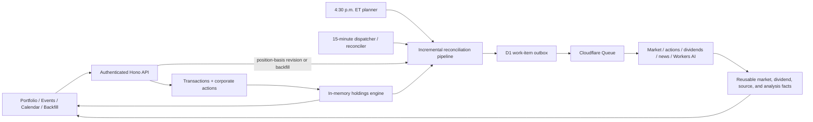

# Portfolio Ledger and Calendar Expansion — Design Specification

Status: Approved; revised for best-effort providers and user-confirmed split history
Date: 2026-07-10

## 1. Summary

Expand the current stock movement explainer into a single-user portfolio ledger with four pages: Portfolio, Events, Calendar, and Backfill.

Buy and sell events become the source of truth for ownership. Current and historical holdings are derived from those events plus user-confirmed provider-reported stock splits; the application does not persist a current-holdings row or checkpoint. Daily market prices, movements, Chinese news summaries, source-reported dividends, and corporate actions are stored as reusable facts keyed by instrument and effective date.

An incremental reconciliation pipeline serves scheduled screening, historical ledger corrections, and explicit backfills. It reuses valid facts and fetches or analyzes only missing or stale dependencies. The frontend uses ASTRYX with its neutral theme and conservative spacing. The monthly and weekly event calendar is the only substantial custom UI component.

## 2. Goals

- Derive current and historical position quantities from manually entered or CSV-imported buy and sell events.
- Show current holdings with quantity, latest completed-close valuation, daily movement, and a Chinese news summary for movements of at least 5% in magnitude.
- Keep native-currency values separate, including independent CAD and USD totals.
- Provide an editable historical event ledger and a documented, atomic CSV import workflow.
- Import provider-reported stock splits and display them as read-only corporate-action rows.
- Show past and announced future ex-dividend events in monthly and weekly calendar views.
- Calculate expected dividend value from shares eligible immediately before the ex-dividend date.
- Show historically accurate daily movers only for stocks held at the start of each trading day.
- Automatically reconcile only affected facts after historical event changes.
- Preserve the current Cloudflare Worker, D1, Queues, Cron, Workers AI, Basic Authentication, and free-tier-conscious deployment shape.
- Support English and Simplified Chinese static UI copy. Stored LLM summaries remain Simplified Chinese in both modes.
- Use ASTRYX components and layout conventions wherever possible, with the neutral theme and little custom CSS.

## 3. Non-goals

- Multiple users, accounts, roles, or per-user portfolios.
- Brokerage connectivity or direct broker CSV formats in the first version.
- Live or intraday quotes. All movement and valuation data uses completed daily bars.
- FX conversion or a combined cross-currency portfolio total.
- Cost basis, realized or unrealized gains, tax-lot accounting, commissions, or account-level reporting.
- Dividend payment-date cash-flow tracking. Calendar dividend events use ex-dividend dates only.
- Predictions of unannounced dividends.
- Editable provider corporate actions.
- Real-time alerts, trading, recommendations, or investment advice.
- Persisted holdings snapshots, monthly checkpoints, or a daily holdings table.
- Replacing Basic Authentication with application accounts.

## 4. Constraints and product rules

- The application remains capped at 100 instruments with a positive current position. Instruments sold to zero remain as historical identities without consuming the current-position limit.
- Supported instruments remain Yahoo-validated US and Canadian stocks and ETFs denominated in USD or CAD.
- A movement qualifies when its unrounded split-adjusted price return has an absolute value of at least 5.00%. Movement excludes dividend adjustments; Portfolio valuation always uses the latest raw completed close.
- Explanations are stored and displayed in Simplified Chinese regardless of the selected UI language.
- Future Calendar dividends include only events currently announced by the selected source; a missing row is not proof that no future dividend exists.
- Transactions record completed trades, so manual entry and CSV import reject future trade dates.
- Provider data remains unofficial and may be corrected or unavailable.
- A historical event cannot become authoritative until the user confirms the displayed split history from its earliest affected date through today for the exact retrieved provider revision.
- Automatic reconciliation may span more than the manual Backfill tool's 30-calendar-day request limit, but it must chunk work and obey the same daily dispatch ceiling.
- The UI should favor information density: compact controls, restrained page gutters, short section gaps, dense tables, and minimal card nesting.

## 5. Ownership and accounting semantics

### 5.1 Ledger inputs

Each editable transaction stores:

- trade date;
- canonical instrument;
- side: `buy` or `sell`;
- quantity;
- native-currency execution price;
- creation and update timestamps;
- revision metadata.

Fees and brokerage account are not captured. The execution price is retained for future accounting capabilities but is not used for cost-basis calculations in this scope.

User-entered quantity and price accept at most six decimal places. The API and D1 store canonical decimal strings, and a domain `Decimal` wrapper backed by arbitrary-precision decimal arithmetic handles folding, multiplication, comparison, and display rounding. Values do not pass through JavaScript `Number`. Split ratios are stored as integer numerator and denominator values and applied with rational arithmetic.

Quantity and price are each bounded to `1,000,000,000` before six fractional digits. Derived quantities retain at least twelve fractional digits internally and display six. If a broker pays cash in lieu after a reverse split, the user records the fractional disposition as a sell event; the application does not infer broker-specific cash handling.

### 5.2 Derived quantity rules

The holdings engine folds transactions and splits in deterministic instrument/date order.

- Portfolio quantity for a date includes transactions dated on or before that date and splits effective on or before that date.
- Daily mover eligibility uses shares held at the start of the trading day: transactions strictly before the trading date and splits effective on or before the trading date.
- Dividend eligibility uses transactions strictly before the ex-dividend date and splits effective on or before the ex-dividend date.
- A buy dated July 10 first qualifies for daily screening on July 11.
- A sell-to-zero dated July 10 remains eligible for July 10 screening and stops on July 11.
- A buy on an ex-dividend date is ineligible; a sell on that date does not remove eligibility.

Every create, edit, delete, or CSV import first requires a user-confirmed split-history snapshot for each affected instrument from its earliest transaction date through today. The service fetches the best-effort provider snapshot, displays its source, requested range, retrieval time, derived revision, split rows, and incomplete-history warning, and records confirmation only after explicit user approval. Confirmation is valid only for the confirmed start/end range and exact provider revision. A changed revision, correction, or newly required earlier start date invalidates it and requires review again. If the provider is unavailable, the proposal remains uncommitted and returns a retryable provider error.

Once confirmation is established, the service performs a full validation fold for affected instruments. The mutation is rejected if quantity becomes negative at the end of any trade date. Same-day buys and sells are validated by their net end-of-day effect because execution time is not stored.

### 5.3 Stock splits

The corporate-action provider imports stock splits as read-only, unverified candidates. A split adjusts derived quantities only after the user confirms the displayed history for the affected range and revision; it never creates an editable buy or sell. Corporate actions appear in the Events timeline with source, effective date, ratio, requested/confirmed range, retrieval and confirmation times, revision, and sync status.

New or corrected split candidates are folded against the full transaction ledger before activation and presented for review. User confirmation of a valid candidate set promotes it atomically, records confirmed start/end, provider revision, and confirmation timestamp, advances the position-basis revision, and creates reconciliation work. A candidate that would make any historical position negative is quarantined rather than offered for activation. A provider revision or correction invalidates the prior confirmation; the last valid active split set remains visible but cannot authorize new affected mutations until the new snapshot is reviewed. Portfolio and Events show a blocking review/conflict state with affected dates. Editing transactions automatically rechecks quarantined candidates; the system never silently accepts an invalid ledger.

While a candidate is quarantined or awaiting review, edits to unrelated instruments remain available. An edit to the affected instrument may commit only after the candidate set is valid and the user confirms that exact revision; the transaction change, confirmation, and promotion then share one guarded batch. This is the resolution path for a provider correction conflict.

Active split revisions invalidate derived eligibility intervals, split-adjusted movement calculations that cross the action, and dependent dividend totals. Market raw closes remain reusable unless their provider revision changed.

### 5.4 Concurrency and revisions

One `position_basis_state` revision covers transactions plus split-history confirmations, candidates, and the active action set. Every manual mutation, CSV commit, candidate refresh, confirmation/invalidation, quarantine, or corporate-action promotion is submitted with its expected revision.

The D1 batch begins by inserting a mutation token. A database trigger compares the token's expected revision with `position_basis_state` and calls `RAISE(ABORT, 'ledger_conflict')` on mismatch; a successful token advances the revision. Transaction/corporate-action writes, the 100-positive-position validation result, reconciliation job creation, and job/work links share that same transactional batch. This prevents two individually valid concurrent proposals from combining into an invalid ledger or exceeding the position limit.

Event `PATCH` and `DELETE` also require the event revision through `If-Match`. A stale tab receives `409 ledger_conflict` and must reload before retrying.

## 6. Architecture



The ledger and normalized provider facts have separate responsibilities:

- The ledger answers whether and how much of an instrument was held on a date.
- Market facts answer what happened to an instrument on a date, independently of ownership.
- Calendar and Portfolio combine a derived ownership view with reusable facts.
- The pipeline ensures required facts exist and refreshes only stale dependencies.

This separation allows a stored market fact to be reused if a transaction correction makes that instrument relevant again. Removing an instrument from a historical holding interval hides it from Calendar without deleting reusable provider data.

## 7. Component boundaries

### 7.1 Instrument service

- Validates and canonicalizes provider symbols.
- Stores company, exchange, currency, instrument type, and provider metadata.
- Does not store an active-watchlist or ownership flag.
- Treats the set of instruments needing current screening as a derived property of the ledger.

### 7.2 Ledger service

- Owns manual transaction CRUD and CSV commits.
- Parses canonical decimal strings into arbitrary-precision domain values.
- Requires user confirmation of the exact best-effort split snapshot before historical validation.
- Validates non-negative historical quantities.
- Calculates the before/after eligibility difference for affected instruments.
- Uses the trigger-enforced expected-revision mutation token.
- Atomically updates transactions, the position-basis revision, reconciliation job, and one job-scoped planning work link. Large globally deduplicated child work sets are materialized and attached idempotently after commit in bounded pages.

### 7.3 Holdings engine

- Loads transactions and split actions in batches.
- Folds them once per request or pipeline-planning operation.
- Returns current quantities, dated quantities, or held intervals through a small typed interface.
- Persists no position snapshots or checkpoints.

### 7.4 Corporate-action and dividend services

Use separate typed provider contracts rather than extending the existing collapsed `corporateActionDates` set:

- `CorporateActionProvider` returns unverified historical split candidates, stable identity, effective date, numerator/denominator, retrieval time, requested range, and derived snapshot/event revisions.
- `DividendProvider` returns source-reported historical and announced future ex-dates, exact per-share amount, currency, stable identity, retrieval time, and revision/correction behavior. Its range is explicitly incomplete.

The approved personal-app provider model uses Yahoo chart v8 for unverified split candidates and Alpha Vantage for source-reported dividends. Recorded fixtures prove parsing, exact fields, corrections, timezone normalization, delisted instruments, and missing-data behavior; they do not prove exhaustive history. Split candidates require explicit user confirmation before use, and dividend consumers must describe absent future rows as "no event currently known from this source" rather than fabricating, predicting, or asserting nonexistence. Alpha Vantage's 25-request/day free quota and incomplete-history warnings remain visible operating constraints.

The corporate-action service stages candidates, validates them against the ledger, records user confirmation for an exact range/revision, promotes confirmed valid revisions, invalidates confirmation on provider change, and quarantines conflicting corrections. The dividend service upserts source-reported facts by provider identity or deterministic fingerprint and recalculates expected totals from the ledger without refetching unchanged events.

### 7.5 Market-fact service

- Retrieves bounded date ranges and emits all completed daily facts in that range, including enough lookback for the preceding trading bar.
- Stores one normalized result per instrument and trading date.
- Stores previous/current raw closes, any split factor crossing the comparison, split-adjusted comparison price, split-adjusted amount/percentage price return, optional raw-close difference for diagnostics, provider revision, and retrieval time.
- Uses raw latest close for Portfolio valuation and split-adjusted raw-close return for movement; it never uses dividend-adjusted close for either purpose.
- Never substitutes an intraday quote for an absent completed bar.

### 7.6 Explanation service

- Runs only for market facts whose absolute unrounded movement is at least 5.00%.
- Reuses an existing analysis when its movement and news dependency fingerprint is unchanged.
- Stores a concise Simplified Chinese summary, model metadata, status, and supporting sources.
- Keeps the last valid result visible if a refresh fails, while marking it stale.

### 7.7 Pipeline service

- Creates one job-scoped planning work item for each Cron, reconciliation, or Backfill job. The planner then links that job to idempotent global child work items.
- Uses fact-granular deterministic work keys for work type, instrument, effective date, dependency revision, and optional forced-refresh generation. Overlapping Cron, Backfill, and reconciliation jobs therefore link to the same logical requirement.
- At dispatch time, groups compatible contiguous market work items for one instrument into a transient range batch of at most 90 calendar days. Qualifying news/analysis batches normally contain one instrument/date.
- Treats pending D1 work and dispatch batches as the authoritative transactional outbox. Queue messages contain only the dispatch-batch ID.
- Claims `pending` work into a consumer-claimable `dispatching` batch with a lease before sending, then conditionally records still-dispatching batch/items as `queued` after send. Consumers may atomically claim the matching unexpired batch from either `dispatching` or `queued`; the acknowledgement never overwrites `processing`. A crash before send or before acknowledgement is recovered after lease expiry, and a duplicate send is harmless.
- Claims work with dispatch and processing leases, retries transient failures with backoff, and records terminal failures.
- Recovers expired `dispatching`, `queued`, and `processing` leases and routes exhausted queue messages to a DLQ while retaining terminal D1 state.
- Respects the existing daily soft dispatch ceiling, prioritizes current-day work over historical reconciliation, and resumes queued work through the recurring dispatcher.
- Reports counts for reused, skipped, fetched, analyzed, processed, and failed work.

## 8. Data model

### `instruments`

- `id`
- `symbol` (unique canonical symbol)
- `company_name`
- `exchange`
- `currency`: `USD` or `CAD`
- `instrument_type`
- provider metadata and timestamps

This table evolves from current ticker metadata. It contains no ownership or active-screening state.

### `transactions`

- `id`, `instrument_id`
- `trade_date`
- `side`: `buy` or `sell`
- canonical `quantity_decimal`
- canonical `price_decimal`
- `created_at`, `updated_at`
- `revision`

Indexes support `(instrument_id, trade_date, id)` and reverse chronological Events queries.

### `corporate_actions`

- `id`, `instrument_id`
- `action_type`: initially `split`
- `effective_date`
- `split_numerator`, `split_denominator`
- provider identity/fingerprint, source, retrieved time, revision
- activation status: `candidate`, `active`, `superseded`, or `quarantined`
- conflict code/message when quarantined
- unique provider/deterministic identity

### `corporate_action_coverage`

- `instrument_id`, provider
- requested start/end dates and retrieved time
- confirmed start/end dates, provider revision, and confirmation timestamp
- status: `review_required`, `confirmed`, `refreshing`, `unavailable`, or `conflict`

Confirmation is valid only for the recorded provider revision and confirmed range. A changed provider revision invalidates confirmation, and a transaction earlier than the confirmed start date forces a broader snapshot and review before validation. Provider results themselves always remain unverified candidates.

### `daily_market_facts`

- `id`, `instrument_id`, `trading_date`
- previous bar date and raw close
- current raw completed close
- crossing split factor and split-adjusted comparison price
- split-adjusted amount change and unrounded split-adjusted percentage return
- optional raw-close difference for diagnostics only
- movement basis: `split_adjusted_price_return` or a legacy migration basis
- provider revision, status, retrieved time, stale/error metadata
- unique `(instrument_id, trading_date)`

Provider numeric inputs are normalized to canonical decimal strings. Domain calculations use the same arbitrary-precision `Decimal` boundary as the ledger; JSON display values are formatted only after calculation.

### `movement_analyses`

- `id`, `daily_market_fact_id` (unique)
- `summary_zh_cn`
- dependency fingerprint
- model, status, created/updated time, stale/error metadata

### `news_sources`

- `id`, `movement_analysis_id`
- source order, title, publisher, publication time, URL, cited state

### `dividend_events`

- `id`, `instrument_id`
- `ex_date`
- canonical `amount_per_share_decimal`
- `currency`
- provider identity/fingerprint, source, announced/retrieved time, revision, status

Expected total value is derived at read time and is not stored.

### `position_basis_state`

- singleton revision covering transactions plus split confirmations, candidates, and the active action set
- update timestamp and last mutation identifier

### `ledger_mutations`

- unique mutation identifier
- expected and resulting position-basis revisions
- mutation kind and timestamp

A `BEFORE INSERT` trigger aborts when the expected revision does not equal the singleton state. Successful insertion advances the state within the same D1 batch.

### `import_batches` and `import_rows`

- file SHA-256 digest and original filename
- base position-basis revision
- normalized preview rows and row-level validation results
- projected holdings summary
- status: `preview`, `committed`, `expired`, or `rejected`
- timestamps

Uncommitted previews expire after 24 hours. Normalized import rows are purged on expiry or seven days after commit. The batch digest, commit status, and resulting job ID are retained so the same file remains detectable without retaining its contents.

### `pipeline_jobs`

- trigger: `scheduled`, `ledger_reconciliation`, or `backfill`
- requested/affected range and instruments
- serialized minimal eligibility intervals needed by the planner
- priority, status, and aggregate progress counters

### `work_items`

- scope: `job_planning` or `global_fact`
- a job-scoped planner key includes `pipeline_job_id`; a global fact key never does
- work type, instrument, effective date, dependency revision, and optional forced-refresh generation
- deterministic uniqueness key
- state: `pending`, `dispatching`, `queued`, `processing`, `complete`, or `terminal`
- dispatch/processing leases, attempt count, timestamps, result revision, and terminal error

### `dispatch_batches` and `dispatch_batch_items`

- transient batch ID, compatible work type/instrument, bounded provider range, state, and lease
- join rows linking one or more work items to the batch

The dispatcher creates these rows transactionally. A market batch groups contiguous pending dates to one provider request while each logical work item retains its own uniqueness, result, and job relationships.

### `job_work_items`

- `pipeline_job_id`, `work_item_id`
- required/optional relationship and job-facing outcome
- unique `(pipeline_job_id, work_item_id)`

Multiple jobs can wait on one globally deduplicated work item while aggregating progress independently.

### `fact_revision_buckets`

- bucket key `latest` for facts that can change current Portfolio output
- `YYYY-MM` bucket keys for market, analysis, and dividend facts displayed by Calendar
- monotonically increasing revision and update timestamp per bucket

Portfolio ETags combine `position_basis_state` with the `latest` buckets. Calendar ETags combine `position_basis_state` with only the one to three month buckets intersecting the requested range. Corporate-action changes advance `position_basis_state`. A historical backfill therefore invalidates only its affected Calendar months, not current Portfolio or unrelated ranges.

Completed work items and job links are retained for 90 days; compact job summaries and terminal/DLQ records are retained for one year. Cleanup is a low-priority D1 work item. Normalized facts, transaction history, corporate-action provenance, and import digests are not removed by this cleanup.

Existing `report_runs`, `screenings`, `analyses`, and `sources` remain during migration and recovery but cease to be the active read/write model after cutover.

## 9. Incremental reconciliation

A transaction mutation or corporate-action promotion calculates old and proposed timelines for its affected instruments before committing. The guarded batch stores the minimal changed eligibility intervals and links the job to one job-scoped planning work item. That planner always runs for its owning job, then creates and attaches globally deduplicated fact-granular child work in bounded pages. A completed planner from another job can never substitute for this attachment step, and a large historical correction never requires thousands of statements in the authoritative ledger batch.

- Quantity changes while a position remains positive do not invalidate market or LLM facts.
- Newly held dates require market facts only when none already exist or when an existing fact is stale.
- Dates that become unheld require no provider work; Calendar excludes them through the current ledger fold.
- Dividend expected totals update from the ledger without provider or LLM work.
- Analyses run only for newly required qualifying market facts or when their dependency fingerprint changed.
- Compatible missing market dates are coalesced into dispatch batches of at most 90 calendar days; one provider response materializes all completed bars in the batch while work remains deduplicated per fact/date.

Large historical changes are split into bounded date/instrument ranges. Planning and execution are resumable and remain under the daily dispatch ceiling. Current-day market work has priority over user backfills, which have priority over automatic historical reconciliation. Automatic reconciliation is not constrained to a 30-day span because it may be correcting the authoritative ledger; the explicit Backfill form retains its 30-calendar-day request limit.

Every work item is safe to redeliver. Concurrent workers cannot publish conflicting fact revisions. A failed replacement never erases a last valid fact or Chinese summary. A forced Backfill refresh uses a new forced-refresh generation so a prior completed work item cannot suppress the requested provider call.

## 10. Scheduled workflow

The scheduler targets 4:30 p.m. `America/Toronto` on weekdays, approximately 30 minutes after the regular US/Canadian close.

Cloudflare Cron schedules are configured for both possible UTC equivalents. The handler converts the scheduled time to `America/Toronto` and performs work only when local time is 4:30 p.m.; the other trigger is a no-op. This produces one run across daylight-saving changes.

A separate dispatcher/reconciler Cron runs every 15 minutes. It recovers expired leases, dispatches pending D1 work by priority under the soft daily ceiling, updates job aggregates, and revisits bars that were not finalized at 4:30 p.m. Queue retention is never the persistence mechanism; D1 retains unfinished work until completion or explicit terminal resolution.

The scheduled planner:

1. Derives start-of-day held instruments.
2. Refreshes relevant split and announced-dividend metadata when stale.
3. Ensures that day's completed market facts exist.
4. Retries with backoff if the provider has not finalized a daily bar.
5. Queues news and AI work only for qualifying movers without a valid current analysis.
6. Completes with success, partial error, or terminal error while preserving successful facts.

A first current buy also requests the latest completed pair of bars so Portfolio does not wait for the next scheduled run.

Bars not finalized at the first attempt retry with bounded backoff for up to six hours, then become terminal for that date. The recurring dispatcher provides the wake-up; the next weekday planner may also satisfy an older still-pending fact.

## 11. CSV import

The documented UTF-8 template has this exact header:

```csv
trade_date,symbol,side,quantity,price
2026-07-02,SHOP.TO,BUY,120,124.016667
2026-07-03,AAPL,BUY,40,227.900000
```

- Dates use `YYYY-MM-DD`.
- Future dates are rejected.
- `side` accepts case-insensitive `BUY` or `SELL` and is normalized.
- Quantity and price must be positive canonical decimal values with at most six fractional digits.
- Symbols are trimmed, uppercased, provider-validated, and canonicalized.
- The first version accepts only the application template, not brokerage-specific exports.

Preview parses and validates every row, fetches any required split-history snapshots, detects a previously committed file digest, folds projected holdings only against confirmed split revisions, and records the current position-basis revision. It returns row errors, projected per-symbol quantities, and any split histories requiring explicit review without modifying transactions. Commit remains unavailable until the user confirms each required range/revision.

Commit succeeds only if every row is valid and the position-basis revision still matches the preview. The trigger-guarded batch inserts all transactions, advances the position-basis revision, creates one reconciliation job, and links its initial planning work atomically. A revision conflict requires a new preview. Valid rows are never partially imported while invalid rows are skipped.

The preview route accepts `multipart/form-data` as a narrow exception to the API's normal JSON-only mutation rule. CSV uploads are limited to 5 MiB and 10,000 data rows. Commit inserts from normalized staging rows rather than resending or reparsing the file.

## 12. HTTP API

All routes remain protected by HTTP Basic Authentication.

### Read APIs

- `GET /api/portfolio`
  - Returns current derived holdings, latest completed market facts, separate CAD/USD totals, summaries, and freshness/error state.
- `GET /api/events?cursor=&symbol=&type=`
  - Returns paginated transactions and read-only split actions in one chronological timeline.
- `GET /api/calendar?start=&end=&view=`
  - Accepts bounded week/month ranges and returns held qualifying movers plus dividend events with derived expected totals.
- `GET /api/pipeline-jobs/:id`
  - Returns progress, reuse/fetch/analyze counts, and bounded error detail.
- `GET /api/backfills/:id`
  - Remains as a compatibility alias or specialized projection over its pipeline job.

### Mutation APIs

- `POST /api/events`
- `PATCH /api/events/:id`
- `DELETE /api/events/:id`
- `POST /api/corporate-actions/confirm`
- `POST /api/event-imports/preview`
- `POST /api/event-imports/:id/commit`
- `POST /api/backfills`

Event mutations that need a new split range return a review-required response with the normalized candidate snapshot rather than committing. Split confirmation carries the instrument, confirmed start/end, provider revision, and expected position-basis revision; it never accepts client-authored split rows. Successful event mutations return the updated event or deletion confirmation plus the reconciliation job identifier. API contracts use decimal strings for user-entered quantities/prices and formatted numeric values only at the UI boundary.

All ordinary mutation routes retain the current JSON content-type requirement and 64 KiB body limit. Only CSV preview uses its explicit multipart and 5 MiB limit.

Every mutation requires a same-origin `Origin`/`Host` check and a non-simple custom request header issued by the app. This prevents the multipart CSV exception from reintroducing form-based CSRF under cached Basic Authentication. CORS remains disabled. Event edits/deletes require `If-Match`; import commit carries the previewed position-basis revision.

Distinct API errors cover invalid decimals, invalid or unsupported symbols, split confirmation required, stale split confirmation, quarantined corporate-action conflicts, negative historical holdings, missing events, duplicate imports, stale import previews, position-basis revision conflicts, range limits, provider unavailability, and pipeline terminal failure.

All stored or provider-returned source links are accepted only when parsed as absolute `http:` or `https:` URLs before persistence and again before rendering.

## 13. Frontend and interaction design

### 13.1 Design system

Install exact pinned versions of:

- `@astryxdesign/core`
- `@astryxdesign/theme-neutral`
- `@astryxdesign/cli` as a development dependency

The application imports ASTRYX reset, component, and neutral-theme CSS in documented cascade order and wraps React in the ASTRYX neutral `Theme` provider. A package script provides stable CLI access for component docs and templates.

ASTRYX is currently beta, so dependencies are pinned exactly and upgraded intentionally with its CLI/codemods and full verification suite.

Use ASTRYX `AppShell`, `SideNav`, page-layout templates, tables, inputs, selectors, buttons, button groups, dialogs, popovers, file input, badges, toasts, pagination, and progress components. Prefer documented composition over wrappers or swizzled source.

The existing large custom stylesheet is replaced by the ASTRYX imports and a small app stylesheet limited to:

- custom monthly/weekly event-calendar grids;
- tabular financial-number alignment;
- event density/overflow behavior;
- unavoidable responsive table/calendar overflow.

Use the neutral theme without bespoke palette overrides. Semantic success, error, warning, and subtle hue tokens distinguish gains, losses, dividends, pending, stale, and failure states.

### 13.2 Shell and language

Desktop uses a persistent, collapsible ASTRYX sidebar for Portfolio, Events, Calendar, and Backfill. The EN / 中文 switch sits at the bottom. Mobile uses the AppShell's compact navigation behavior.

Static strings pass through a lightweight typed translation wrapper. The selected locale persists in local storage. With no stored preference, Chinese browser locales default to Simplified Chinese and all others default to English. Dates and numbers use locale-aware formatting, while currency always remains the instrument's native USD or CAD. Stored summaries are never machine-translated.

### 13.3 Density

- Default page gutters are approximately 16px on ordinary desktop widths and smaller on narrow screens.
- Section gaps are approximately 12px.
- Use compact ASTRYX control sizes and dense table rows.
- Avoid oversized headings, decorative empty space, cards nested inside cards, and redundant summary panels.
- Tables retain horizontal overflow where collapsing columns would hide financial meaning.

### 13.4 Portfolio

- Shows separate CAD and USD valuation totals.
- Table columns: symbol/company, quantity, latest completed price, valuation, today's amount/percentage movement, and Chinese summary/status.
- Valuation is `current derived quantity × latest raw completed close`; daily movement is the split-adjusted, dividend-unadjusted price return.
- Both displayed movement amount and percentage use the split-adjusted comparison basis. Raw-close difference is never shown as daily movement on a split date.
- The header and each row identify the actual latest completed trading date, including on weekends and market holidays.
- Non-qualifying holdings show no summary placeholder beyond a compact dash/status.
- Qualifying movers show the stored Chinese summary and a source action.
- Pending, stale, and failed facts remain visible without blocking other rows.

### 13.5 Events

- Displays reverse-chronological buys, sells, and read-only split actions.
- Supports filters, pagination, manual add, transaction edit, and transaction delete.
- Destructive edits use an ASTRYX confirmation dialog and show the resulting reconciliation job.
- CSV import uses FileInput, a validation summary, row-error table, projected holdings table, and explicit commit action.
- Unconfirmed or invalidated split history and quarantined provider corrections appear as prominent actionable states. Review shows source, requested range, retrieval time, provider revision, exact split rows, and an incomplete-history warning. A quarantined correction identifies the invalid dates and remains blocked until transaction edits make the candidate ledger valid and the user confirms the resulting revision.

### 13.6 Calendar

Build an application-specific event calendar rather than adopting a second calendar library. Its public pieces follow ASTRYX naming and composition conventions:

- `MarketCalendar`
- `CalendarToolbar`
- `MonthGrid`
- `WeekGrid`
- `CalendarEvent`
- `MoverDialog`

ASTRYX buttons, button groups, badges, popovers, dialogs, typography, icons, focus styles, and neutral tokens supply the controls and visual language. Custom CSS Grid provides only the spatial month/week layouts.

Both layouts show all-day event chips because daily movers and ex-dividend events have dates, not intraday times. Month view uses a seven-column grid with bounded visible chips and a `more` disclosure for busy dates. Week view uses seven denser day columns without an hourly time axis. Controls provide previous, today, next, and week/month selection.

Mover events show symbol and signed percentage. Activating one opens an accessible ASTRYX dialog containing date, completed prices, movement, Chinese summary, status, and source links. Dividend events show symbol and expected native-currency total; details include eligible shares, per-share amount, source, and best-effort freshness. Empty future dates never imply that no dividend will be announced.

### 13.7 Backfill

- Retains the inclusive date-range and reprocess controls with the 30-calendar-day limit.
- Uses the same incremental pipeline as Cron and ledger reconciliation.
- A normal Backfill ensures missing or stale facts; `reprocess` explicitly refreshes facts in the range and invalidates dependent analyses only when their refreshed dependency fingerprint changes.
- Shows reused, skipped, fetched, analyzed, processed, and failed counts.
- Lists manual backfills and automatic reconciliation jobs in clearly labeled groups.
- Provides targeted retry actions only for retryable terminal tasks.

## 14. Performance design

Portfolio and Calendar must not perform queries per symbol, date cell, or event.

- Portfolio batch-loads ledger entries, splits, and latest facts, then folds the ledger once.
- Calendar batch-loads ledger entries, splits, market facts, analyses, sources, and dividends for its bounded range, then folds once.
- Sources are loaded in batches rather than hydrated per mover.
- Pipeline planning creates fact-granular work per affected instrument/date; dispatch groups compatible contiguous items into bounded range batches.
- Facts are reused by `(instrument_id, effective_date, dependency_revision)` rather than copied into report generations.
- Portfolio and Calendar ETags are composed from the position-basis revision, `latest` or intersecting `YYYY-MM` fact-revision buckets, locale, and requested range. An unchanged conditional request reads only those bucket/state rows and returns `304` without replaying the ledger.
- The UI polls only the small pipeline-job status endpoint. Completion invalidates Portfolio or Calendar once; it never polls their full payloads.
- Client query state reuses unchanged Portfolio and Calendar responses across navigation.

No holdings checkpoint is stored initially. Introduce a rebuildable cache only if measurement demonstrates a need and only through a separately approved design.

Benchmarks cover 100 instruments, 10,000 transactions, five years of normalized facts, and a busy calendar month. Tests assert bounded query counts, rows read, CPU time, serialized response size, and provider-call counts; they prohibit N+1 and per-date market requests. An unchanged conditional Portfolio or Calendar request must read no more than ten revision/state rows. Request and work-item timing is emitted through safe structured diagnostics; pipeline counters distinguish reused, skipped, fetched, analyzed, processed, and failed work.

## 15. Reliability and error handling

- Ledger mutations and CSV commits either complete atomically with their reconciliation job or make no authoritative change.
- A trigger-enforced position-basis revision prevents concurrent invalid combinations and stale multi-tab writes.
- Historical transaction validation cannot run until the user confirms the displayed split history for the required range and exact provider revision.
- Provider split corrections are staged and validated; invalid candidates are quarantined without replacing the active ledger basis.
- A changed split provider revision invalidates confirmation and requires review again; other provider corrections update facts by revision and invalidate only downstream dependencies.
- Last valid market facts and summaries remain visible with stale state when refreshes fail.
- Missing completed bars never become zero movement.
- Global work items use deterministic keys, leases, bounded retries, terminal D1 recording, and a Queue DLQ.
- D1 pending work is the transactional outbox and survives Queue retention or send failures.
- Duplicate queue delivery and repeated Cron triggers are safe.
- A full-market holiday produces no false daily events.
- Logs include identifiers, work types, dates, durations, and bounded error codes, but never Basic Auth headers, CSV contents, full provider payloads, or model prompts.
- The 4:30 p.m. ET dual-UTC Cron guard prevents duplicate DST execution.
- The 15-minute dispatcher guarantees wake-up for paused ceilings, delayed bars, expired leases, and failed sends.

## 16. Migration and rollout

Migration is additive and staged:

1. Apply only additive schema changes. The currently deployed Worker remains compatible while the migration runs before deployment.
2. Deploy a compatibility Worker that continues serving legacy reads but dual-writes every newly published screening fact, analysis, and source into the normalized model.
3. Copy every ticker identity, including soft-deleted tickers and any identity referenced by a screening, into `instruments` while preserving IDs.
4. Run an idempotent resumable migrator. For each trading date, only the screening belonging to that date's currently `published = 1` report generation can win `(instrument_id, trading_date)`. Unpublished and superseded generations remain solely in legacy tables.
5. Store `legacy_run_id`, `legacy_screening_id`, generation, and content hash as migration provenance. Preserve the old `adjusted`/`close` basis as `legacy_adjusted` or `legacy_close`, but never treat that row as authoritative for Portfolio or emit it as a Calendar mover. Once the ledger makes that instrument/date relevant, the planner treats the legacy basis as stale and refreshes it to raw/split-adjusted semantics; Calendar shows pending coverage until refresh completes. Legacy sources may be reused only if the new dependency fingerprint permits it.
6. Record a report-run high-water mark, migrate through it, then perform catch-up passes while dual-write remains active. Reprocessing that changes the published generation deterministically upserts the new winner and provenance.
7. Verify counts, uniqueness, provenance hashes, and sampled API equivalence. Require two consecutive catch-up passes with no unexplained differences.
8. Switch Portfolio and Calendar reads behind a deployment feature flag. Keep legacy reads available for immediate rollback.
9. Switch scheduled and Backfill writes to the work-item pipeline during a short dispatch freeze, run one final catch-up, then resume through the 15-minute dispatcher.
10. Leave existing report tables intact and read-only for recovery until the new flows have been verified in production.

The existing watchlist cannot be converted into transactions because it has no quantity or execution history. Portfolio therefore remains empty until transactions are entered or imported. Once historical transactions exist, only migrated facts already using the new basis can populate Calendar immediately; legacy-basis rows enter the refresh pipeline first.

## 17. Testing and verification

### Domain tests

- Canonical decimal parsing, arbitrary-precision arithmetic, bounds, multiplication, and display rounding without JavaScript `Number` conversion.
- Multiple buys/sells, same-day netting, fractional quantities, and negative-history rejection.
- Portfolio, start-of-day screening, and ex-dividend eligibility boundaries.
- Forward/reverse splits, fractional cash-in-lieu sell events, corrected split revisions, required user confirmation, revision-driven confirmation invalidation, valid confirmed promotion, and invalid-candidate quarantine.
- Raw-close valuation and split-adjusted/dividend-unadjusted movement on ordinary, split, and ex-dividend dates.
- Expected dividends in native currency.

### Provider contract tests

- Unverified historical split snapshots with exact ratios, stable identities, retrieval time, and derived snapshot revisions.
- Source-reported past/future dividend rows with exact per-share amounts and currencies.
- Corrections, missing fields, timezones, delisted instruments, duplicate identities, and bounded range retrieval.
- A missing future dividend row means no announced event is currently known from that source, not proof of absence.
- Fixtures validate normalized parser behavior; downstream split use still requires user confirmation and preserves incomplete-history warnings.

### Pipeline tests

- Before/after interval diffing.
- Quantity-only changes that reuse all facts.
- Newly held and newly unheld date ranges.
- Dependency fingerprints and minimal analysis invalidation.
- Global work deduplication with independent progress for two jobs requesting the same fact.
- Job-scoped planning that attaches shared child work independently for every requesting job.
- Transactional outbox creation, consumer claim from `dispatching`/`queued`, acknowledgement race, send-failure recovery, concurrent claims, expired dispatch/processing leases, retries, redelivery, DLQ, quota pause, priority, and 15-minute resume.
- Fact-granular deduplication plus per-instrument dispatch-range coalescing with no per-date market provider requests.
- Data-not-finalized retry after the scheduled close.

### Database and API tests

- Additive migration and legacy fact conversion.
- Published-generation winner selection, superseded-generation exclusion, deleted-ticker identity preservation, provenance hashes, dual-write high-water catch-up, rollback flag, and refusal to expose legacy-basis rows before refresh.
- Repository indexes and uniqueness constraints.
- Concurrent transaction CRUD/import/corporate-action promotion against one expected position-basis revision, including trigger abort and 100-position races.
- Event `If-Match`, CSV preview, split-history review/confirmation, confirmation invalidation, row errors, duplicate digest, stale revision, and atomic commit.
- Portfolio and Calendar batch queries and conditional `304` fast paths.
- Auth, CSRF/origin enforcement, input bounds, body limits, URL-scheme validation, and distinct error contracts.

### Frontend tests

- ASTRYX neutral provider and responsive AppShell navigation.
- English/Chinese switching and persistence.
- Portfolio table totals, summaries, stale/pending/error states, and source actions.
- Events forms, edit/delete confirmation, split rows, filters, and pagination.
- CSV preview and commit states.
- Month/week Calendar navigation, date math, event overflow, keyboard operation, mover dialog, and dividend detail.
- Toronto timezone and DST boundaries.
- Desktop and phone layouts with conservative spacing and no clipped controls.

### Performance verification

- Benchmark 100 instruments, 10,000 transactions, five years of facts, and a busy month.
- Assert bounded queries, rows read, CPU, response size, and provider calls with no per-row/per-cell/per-date requests.
- Assert an unchanged conditional Portfolio or Calendar request reads at most ten state rows and returns `304`.
- Assert a historical fact update invalidates only its `YYYY-MM` Calendar bucket and does not invalidate the Portfolio `latest` bucket or unrelated months.
- Record Portfolio, Calendar, planner, range-fetch, and work-item timing during integration tests.

The final gate is `npm run check` extended with the new focused domain, Worker/D1 integration, component, accessibility, responsive, and performance suites.

## 18. Acceptance criteria

- A user can create, edit, delete, or atomically import transactions and see correct derived holdings without a persisted holdings row.
- Historical transaction changes commit only with user-confirmed split history for the required range and exact provider revision, plus a trigger-enforced expected position-basis revision.
- A historical correction automatically queues only required fact work and visibly reports progress.
- Portfolio shows separate CAD/USD totals and current holdings valued at the latest raw completed close.
- A held stock moving at least 5% shows its stored Chinese summary; smaller movements do not invoke the LLM.
- Movement uses split-adjusted, dividend-unadjusted raw-close price return; split and ex-dividend dates do not create adjustment artifacts.
- Calendar switches between month and week, shows historically held movers and ex-dividend events, and opens an accessible Chinese-summary dialog for movers.
- Dividend totals use shares held immediately before the ex-date and remain in native currency.
- Provider-reported splits adjust holdings only after user confirmation and appear as read-only Events rows with source/revision status.
- Provider split corrections that would invalidate the ledger are quarantined and visible rather than silently applied.
- The weekday pipeline starts at 4:30 p.m. ET across DST and retries bars that are not finalized.
- A 15-minute dispatcher resumes delayed, quota-paused, and send-failed D1 work; shared work items report progress to every requesting job.
- UI static copy switches between English and Simplified Chinese while summaries remain Chinese.
- The interface follows ASTRYX neutral conventions with compact spacing and only narrowly scoped custom calendar/layout CSS.
- Only currently published legacy generations win normalized fact keys; migration remains resumable, provenance-backed, dual-written, and reversible until cutover verification.
- Verification demonstrates bounded row reads, CPU, response size, provider calls, and batch-query behavior at the agreed performance fixture size.
