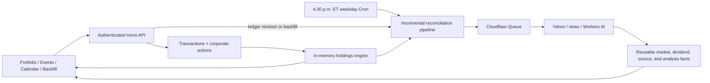

# Portfolio Ledger and Calendar Expansion — Design Specification

Status: Design approved; awaiting written-spec review
Date: 2026-07-10

## 1. Summary

Expand the current stock movement explainer into a single-user portfolio ledger with four pages: Portfolio, Events, Calendar, and Backfill.

Buy and sell events become the source of truth for ownership. Current and historical holdings are derived from those events plus provider-reported stock splits; the application does not persist a current-holdings row or checkpoint. Daily market prices, movements, Chinese news summaries, dividends, and corporate actions are stored as reusable facts keyed by instrument and effective date.

An incremental reconciliation pipeline serves scheduled screening, historical ledger corrections, and explicit backfills. It reuses valid facts and fetches or analyzes only missing or stale dependencies. The frontend uses ASTRYX with its neutral theme and conservative spacing. The monthly and weekly event calendar is the only substantial custom UI component.

## 2. Goals

- Derive current and historical position quantities from manually entered or CSV-imported buy and sell events.
- Show current holdings with quantity, latest completed-close valuation, daily movement, and a Chinese news summary for movements of at least 5% in magnitude.
- Keep native-currency values separate, including independent CAD and USD totals.
- Provide an editable historical event ledger and a documented, atomic CSV import workflow.
- Import provider-reported stock splits and display them as read-only corporate-action rows.
- Show past and announced future ex-dividend events in monthly and weekly calendar views.
- Calculate expected dividend value from shares eligible immediately before the ex-dividend date.
- Show historically accurate daily movers only for stocks held at the start of each trading day.
- Automatically reconcile only affected facts after historical event changes.
- Preserve the current Cloudflare Worker, D1, Queues, Cron, Workers AI, Basic Authentication, and free-tier-conscious deployment shape.
- Support English and Simplified Chinese static UI copy. Stored LLM summaries remain Simplified Chinese in both modes.
- Use ASTRYX components and layout conventions wherever possible, with the neutral theme and little custom CSS.

## 3. Non-goals

- Multiple users, accounts, roles, or per-user portfolios.
- Brokerage connectivity or direct broker CSV formats in the first version.
- Live or intraday quotes. All movement and valuation data uses completed daily bars.
- FX conversion or a combined cross-currency portfolio total.
- Cost basis, realized or unrealized gains, tax-lot accounting, commissions, or account-level reporting.
- Dividend payment-date cash-flow tracking. Calendar dividend events use ex-dividend dates only.
- Predictions of unannounced dividends.
- Editable provider corporate actions.
- Real-time alerts, trading, recommendations, or investment advice.
- Persisted holdings snapshots, monthly checkpoints, or a daily holdings table.
- Replacing Basic Authentication with application accounts.

## 4. Constraints and product rules

- The application remains capped at 100 instruments with a positive current position. Instruments sold to zero remain as historical identities without consuming the current-position limit.
- Supported instruments remain Yahoo-validated US and Canadian stocks and ETFs denominated in USD or CAD.
- A movement qualifies when its unrounded completed close-to-close percentage has an absolute value of at least 5.00%.
- Explanations are stored and displayed in Simplified Chinese regardless of the selected UI language.
- Future Calendar dividends include only events announced by the provider.
- Transactions record completed trades, so manual entry and CSV import reject future trade dates.
- Provider data remains unofficial and may be corrected or unavailable.
- Automatic reconciliation may span more than the manual Backfill tool's 30-calendar-day request limit, but it must chunk work and obey the same daily dispatch ceiling.
- The UI should favor information density: compact controls, restrained page gutters, short section gaps, dense tables, and minimal card nesting.

## 5. Ownership and accounting semantics

### 5.1 Ledger inputs

Each editable transaction stores:

- trade date;
- canonical instrument;
- side: `buy` or `sell`;
- quantity;
- native-currency execution price;
- creation and update timestamps;
- revision metadata.

Fees and brokerage account are not captured. The execution price is retained for future accounting capabilities but is not used for cost-basis calculations in this scope.

User-entered quantity and price accept at most six decimal places. The API accepts canonical decimal strings, and D1 stores integer micro-units to avoid binary floating-point errors. Split ratios are stored as integer numerator and denominator values.

### 5.2 Derived quantity rules

The holdings engine folds transactions and splits in deterministic instrument/date order.

- Portfolio quantity for a date includes transactions dated on or before that date and splits effective on or before that date.
- Daily mover eligibility uses shares held at the start of the trading day: transactions strictly before the trading date and splits effective on or before the trading date.
- Dividend eligibility uses transactions strictly before the ex-dividend date and splits effective on or before the ex-dividend date.
- A buy dated July 10 first qualifies for daily screening on July 11.
- A sell-to-zero dated July 10 remains eligible for July 10 screening and stops on July 11.
- A buy on an ex-dividend date is ineligible; a sell on that date does not remove eligibility.

Every create, edit, delete, or CSV import performs a full validation fold for affected instruments. The mutation is rejected if quantity becomes negative at the end of any trade date. Same-day buys and sells are validated by their net end-of-day effect because execution time is not stored.

### 5.3 Stock splits

The provider adapter imports stock splits as read-only corporate actions. A split adjusts derived quantities but never creates an editable buy or sell. Corporate actions appear in the Events timeline with source, effective date, ratio, and sync status. A corrected provider split invalidates only derived eligibility ranges and dependent dividend totals; reusable market facts remain valid unless their own provider inputs change.

## 6. Architecture



The ledger and normalized provider facts have separate responsibilities:

- The ledger answers whether and how much of an instrument was held on a date.
- Market facts answer what happened to an instrument on a date, independently of ownership.
- Calendar and Portfolio combine a derived ownership view with reusable facts.
- The pipeline ensures required facts exist and refreshes only stale dependencies.

This separation allows a stored market fact to be reused if a transaction correction makes that instrument relevant again. Removing an instrument from a historical holding interval hides it from Calendar without deleting reusable provider data.

## 7. Component boundaries

### 7.1 Instrument service

- Validates and canonicalizes provider symbols.
- Stores company, exchange, currency, instrument type, and provider metadata.
- Does not store an active-watchlist or ownership flag.
- Treats the set of instruments needing current screening as a derived property of the ledger.

### 7.2 Ledger service

- Owns manual transaction CRUD and CSV commits.
- Parses canonical decimal strings into fixed-precision values.
- Validates non-negative historical quantities.
- Calculates the before/after eligibility difference for affected instruments.
- Atomically updates the ledger revision and creates a reconciliation job.

### 7.3 Holdings engine

- Loads transactions and split actions in batches.
- Folds them once per request or pipeline-planning operation.
- Returns current quantities, dated quantities, or held intervals through a small typed interface.
- Persists no position snapshots or checkpoints.

### 7.4 Corporate-action and dividend service

- Retrieves provider-reported splits and dividends for relevant instruments.
- Upserts facts using stable provider identity or a deterministic fingerprint.
- Stores provenance, retrieval time, and content revision.
- Treats future dividends as announced events, not predictions.
- Recalculates expected dividend totals from the ledger without refetching unchanged dividend facts.

### 7.5 Market-fact service

- Retrieves the target completed daily bar and immediately preceding completed bar.
- Stores one normalized result per instrument and trading date.
- Records adjusted/close price basis, prices, amount change, percentage change, provider revision, and retrieval time.
- Never substitutes an intraday quote for an absent completed bar.

### 7.6 Explanation service

- Runs only for market facts whose absolute unrounded movement is at least 5.00%.
- Reuses an existing analysis when its movement and news dependency fingerprint is unchanged.
- Stores a concise Simplified Chinese summary, model metadata, status, and supporting sources.
- Keeps the last valid result visible if a refresh fails, while marking it stale.

### 7.7 Pipeline service

- Plans idempotent tasks for Cron, ledger reconciliation, and Backfill.
- Uses deterministic uniqueness keys for fact type, instrument, effective date, and dependency revision.
- Claims tasks with leases, retries transient failures with backoff, and records terminal failures.
- Respects the existing daily soft dispatch ceiling and resumes queued work later.
- Reports counts for reused, skipped, fetched, analyzed, processed, and failed work.

## 8. Data model

### `instruments`

- `id`
- `symbol` (unique canonical symbol)
- `company_name`
- `exchange`
- `currency`: `USD` or `CAD`
- `instrument_type`
- provider metadata and timestamps

This table evolves from current ticker metadata. It contains no ownership or active-screening state.

### `transactions`

- `id`, `instrument_id`
- `trade_date`
- `side`: `buy` or `sell`
- `quantity_microunits`
- `price_microunits`
- `created_at`, `updated_at`
- `revision`

Indexes support `(instrument_id, trade_date, id)` and reverse chronological Events queries.

### `corporate_actions`

- `id`, `instrument_id`
- `action_type`: initially `split`
- `effective_date`
- `split_numerator`, `split_denominator`
- provider identity/fingerprint, source, retrieved time, revision
- unique provider/deterministic identity

### `daily_market_facts`

- `id`, `instrument_id`, `trading_date`
- previous bar date and price
- current completed price
- change amount and unrounded percentage
- price basis
- provider revision, status, retrieved time, stale/error metadata
- unique `(instrument_id, trading_date)`

Provider-derived prices and movement values may use SQLite real values because they are display/screening facts, not user-entered accounting amounts.

### `movement_analyses`

- `id`, `daily_market_fact_id` (unique)
- `summary_zh_cn`
- dependency fingerprint
- model, status, created/updated time, stale/error metadata

### `news_sources`

- `id`, `movement_analysis_id`
- source order, title, publisher, publication time, URL, cited state

### `dividend_events`

- `id`, `instrument_id`
- `ex_date`
- `amount_per_share_microunits`
- `currency`
- provider identity/fingerprint, source, announced/retrieved time, revision, status

Expected total value is derived at read time and is not stored.

### `ledger_state`

- singleton ledger revision and update timestamp

### `import_batches` and `import_rows`

- file SHA-256 digest and original filename
- base ledger revision
- normalized preview rows and row-level validation results
- projected holdings summary
- status: `preview`, `committed`, `expired`, or `rejected`
- timestamps

### `pipeline_jobs` and `pipeline_tasks`

- job trigger: `scheduled`, `ledger_reconciliation`, or `backfill`
- requested/affected range and instruments
- status and aggregate progress counters
- task type, dependency key/revision, uniqueness key, lease, attempt count, timestamps, and terminal error

Existing `report_runs`, `screenings`, `analyses`, and `sources` remain during migration and recovery but cease to be the active read/write model after cutover.

## 9. Incremental reconciliation

A ledger mutation calculates old and proposed timelines for its affected instruments before committing. The resulting job stores the minimal changed eligibility intervals.

- Quantity changes while a position remains positive do not invalidate market or LLM facts.
- Newly held dates require market facts only when none already exist or when an existing fact is stale.
- Dates that become unheld require no provider work; Calendar excludes them through the current ledger fold.
- Dividend expected totals update from the ledger without provider or LLM work.
- Analyses run only for newly required qualifying market facts or when their dependency fingerprint changed.

Large historical changes are split into bounded date/instrument task pages. Planning and execution are resumable and remain under the daily dispatch ceiling. Automatic reconciliation is not constrained to a 30-day span because it may be correcting the authoritative ledger; the explicit Backfill form retains its 30-calendar-day request limit.

Every task is safe to redeliver. Concurrent workers cannot publish conflicting fact revisions. A failed replacement never erases a last valid fact or Chinese summary.

## 10. Scheduled workflow

The scheduler targets 4:30 p.m. `America/Toronto` on weekdays, approximately 30 minutes after the regular US/Canadian close.

Cloudflare Cron schedules are configured for both possible UTC equivalents. The handler converts the scheduled time to `America/Toronto` and performs work only when local time is 4:30 p.m.; the other trigger is a no-op. This produces one run across daylight-saving changes.

The scheduled planner:

1. Derives start-of-day held instruments.
2. Refreshes relevant split and announced-dividend metadata when stale.
3. Ensures that day's completed market facts exist.
4. Retries with backoff if the provider has not finalized a daily bar.
5. Queues news and AI work only for qualifying movers without a valid current analysis.
6. Completes with success, partial error, or terminal error while preserving successful facts.

A first current buy also requests the latest completed pair of bars so Portfolio does not wait for the next scheduled run.

## 11. CSV import

The documented UTF-8 template has this exact header:

```csv
trade_date,symbol,side,quantity,price
2026-07-02,SHOP.TO,BUY,120,124.016667
2026-07-03,AAPL,BUY,40,227.900000
```

- Dates use `YYYY-MM-DD`.
- Future dates are rejected.
- `side` accepts case-insensitive `BUY` or `SELL` and is normalized.
- Quantity and price must be positive canonical decimal values with at most six fractional digits.
- Symbols are trimmed, uppercased, provider-validated, and canonicalized.
- The first version accepts only the application template, not brokerage-specific exports.

Preview parses and validates every row, detects a previously committed file digest, folds projected holdings, and records the current ledger revision. It returns row errors and projected per-symbol quantities without modifying transactions.

Commit succeeds only if every row is valid and the ledger revision still matches the preview. It inserts all transactions, advances the ledger revision, and creates one reconciliation job atomically. A revision conflict requires a new preview. Valid rows are never partially imported while invalid rows are skipped.

The preview route accepts `multipart/form-data` as a narrow exception to the API's normal JSON-only mutation rule. CSV uploads are limited to 5 MiB and 10,000 data rows. Commit inserts from normalized staging rows rather than resending or reparsing the file.

## 12. HTTP API

All routes remain protected by HTTP Basic Authentication.

### Read APIs

- `GET /api/portfolio`
  - Returns current derived holdings, latest completed market facts, separate CAD/USD totals, summaries, and freshness/error state.
- `GET /api/events?cursor=&symbol=&type=`
  - Returns paginated transactions and read-only split actions in one chronological timeline.
- `GET /api/calendar?start=&end=&view=`
  - Accepts bounded week/month ranges and returns held qualifying movers plus dividend events with derived expected totals.
- `GET /api/pipeline-jobs/:id`
  - Returns progress, reuse/fetch/analyze counts, and bounded error detail.
- `GET /api/backfills/:id`
  - Remains as a compatibility alias or specialized projection over its pipeline job.

### Mutation APIs

- `POST /api/events`
- `PATCH /api/events/:id`
- `DELETE /api/events/:id`
- `POST /api/event-imports/preview`
- `POST /api/event-imports/:id/commit`
- `POST /api/backfills`

Event mutations return the updated event or deletion confirmation plus the reconciliation job identifier. API contracts use decimal strings for user-entered quantities/prices and formatted numeric values only at the UI boundary.

All ordinary mutation routes retain the current JSON content-type requirement and 64 KiB body limit. Only CSV preview uses its explicit multipart and 5 MiB limit.

Distinct API errors cover invalid decimals, invalid or unsupported symbols, negative historical holdings, missing events, duplicate imports, stale import previews, ledger revision conflicts, range limits, provider unavailability, and pipeline terminal failure.

## 13. Frontend and interaction design

### 13.1 Design system

Install exact pinned versions of:

- `@astryxdesign/core`
- `@astryxdesign/theme-neutral`
- `@astryxdesign/cli` as a development dependency

The application imports ASTRYX reset, component, and neutral-theme CSS in documented cascade order and wraps React in the ASTRYX neutral `Theme` provider. A package script provides stable CLI access for component docs and templates.

ASTRYX is currently beta, so dependencies are pinned exactly and upgraded intentionally with its CLI/codemods and full verification suite.

Use ASTRYX `AppShell`, `SideNav`, page-layout templates, tables, inputs, selectors, buttons, button groups, dialogs, popovers, file input, badges, toasts, pagination, and progress components. Prefer documented composition over wrappers or swizzled source.

The existing large custom stylesheet is replaced by the ASTRYX imports and a small app stylesheet limited to:

- custom monthly/weekly event-calendar grids;
- tabular financial-number alignment;
- event density/overflow behavior;
- unavoidable responsive table/calendar overflow.

Use the neutral theme without bespoke palette overrides. Semantic success, error, warning, and subtle hue tokens distinguish gains, losses, dividends, pending, stale, and failure states.

### 13.2 Shell and language

Desktop uses a persistent, collapsible ASTRYX sidebar for Portfolio, Events, Calendar, and Backfill. The EN / 中文 switch sits at the bottom. Mobile uses the AppShell's compact navigation behavior.

Static strings pass through a lightweight typed translation wrapper. The selected locale persists in local storage. With no stored preference, Chinese browser locales default to Simplified Chinese and all others default to English. Dates and numbers use locale-aware formatting, while currency always remains the instrument's native USD or CAD. Stored summaries are never machine-translated.

### 13.3 Density

- Default page gutters are approximately 16px on ordinary desktop widths and smaller on narrow screens.
- Section gaps are approximately 12px.
- Use compact ASTRYX control sizes and dense table rows.
- Avoid oversized headings, decorative empty space, cards nested inside cards, and redundant summary panels.
- Tables retain horizontal overflow where collapsing columns would hide financial meaning.

### 13.4 Portfolio

- Shows separate CAD and USD valuation totals.
- Table columns: symbol/company, quantity, latest completed price, valuation, today's amount/percentage movement, and Chinese summary/status.
- Valuation is `current derived quantity × latest completed price`.
- The header and each row identify the actual latest completed trading date, including on weekends and market holidays.
- Non-qualifying holdings show no summary placeholder beyond a compact dash/status.
- Qualifying movers show the stored Chinese summary and a source action.
- Pending, stale, and failed facts remain visible without blocking other rows.

### 13.5 Events

- Displays reverse-chronological buys, sells, and read-only split actions.
- Supports filters, pagination, manual add, transaction edit, and transaction delete.
- Destructive edits use an ASTRYX confirmation dialog and show the resulting reconciliation job.
- CSV import uses FileInput, a validation summary, row-error table, projected holdings table, and explicit commit action.

### 13.6 Calendar

Build an application-specific event calendar rather than adopting a second calendar library. Its public pieces follow ASTRYX naming and composition conventions:

- `MarketCalendar`
- `CalendarToolbar`
- `MonthGrid`
- `WeekGrid`
- `CalendarEvent`
- `MoverDialog`

ASTRYX buttons, button groups, badges, popovers, dialogs, typography, icons, focus styles, and neutral tokens supply the controls and visual language. Custom CSS Grid provides only the spatial month/week layouts.

Both layouts show all-day event chips because daily movers and ex-dividend events have dates, not intraday times. Month view uses a seven-column grid with bounded visible chips and a `more` disclosure for busy dates. Week view uses seven denser day columns without an hourly time axis. Controls provide previous, today, next, and week/month selection.

Mover events show symbol and signed percentage. Activating one opens an accessible ASTRYX dialog containing date, completed prices, movement, Chinese summary, status, and source links. Dividend events show symbol and expected native-currency total; details include eligible shares and per-share amount.

### 13.7 Backfill

- Retains the inclusive date-range and reprocess controls with the 30-calendar-day limit.
- Uses the same incremental pipeline as Cron and ledger reconciliation.
- A normal Backfill ensures missing or stale facts; `reprocess` explicitly refreshes facts in the range and invalidates dependent analyses only when their refreshed dependency fingerprint changes.
- Shows reused, skipped, fetched, analyzed, processed, and failed counts.
- Lists manual backfills and automatic reconciliation jobs in clearly labeled groups.
- Provides targeted retry actions only for retryable terminal tasks.

## 14. Performance design

Portfolio and Calendar must not perform queries per symbol, date cell, or event.

- Portfolio batch-loads ledger entries, splits, and latest facts, then folds the ledger once.
- Calendar batch-loads ledger entries, splits, market facts, analyses, sources, and dividends for its bounded range, then folds once.
- Sources are loaded in batches rather than hydrated per mover.
- Pipeline planning operates per affected instrument and pages long date ranges into bounded tasks.
- Facts are reused by `(instrument_id, effective_date, dependency_revision)` rather than copied into report generations.

No holdings checkpoint is stored initially. Introduce a rebuildable cache only if measurement demonstrates a need and only through a separately approved design.

Benchmarks cover 100 instruments, 10,000 transactions, five years of normalized facts, and a busy calendar month. Tests assert bounded query counts and prohibit N+1 patterns. Request and task timing is emitted through safe structured diagnostics; pipeline counters distinguish reused, skipped, fetched, analyzed, processed, and failed work.

## 15. Reliability and error handling

- Ledger mutations and CSV commits either complete atomically with their reconciliation job or make no authoritative change.
- A ledger revision prevents stale multi-tab CSV commits.
- Provider corrections update facts by revision and invalidate only downstream dependencies.
- Last valid market facts and summaries remain visible with stale state when refreshes fail.
- Missing completed bars never become zero movement.
- Queue tasks use deterministic keys, leases, bounded retries, and terminal error recording.
- Duplicate queue delivery and repeated Cron triggers are safe.
- A full-market holiday produces no false daily events.
- Logs include identifiers, task types, dates, durations, and bounded error codes, but never Basic Auth headers, CSV contents, full provider payloads, or model prompts.
- The 4:30 p.m. ET dual-UTC Cron guard prevents duplicate DST execution.

## 16. Migration and rollout

Migration is additive and staged:

1. Create `instruments`, ledger, normalized-fact, import, and pipeline tables with indexes and constraints.
2. Copy current ticker metadata into instruments.
3. Convert completed screening prices, analyses, and sources into normalized facts using deterministic uniqueness keys.
4. Verify counts, key uniqueness, and sampled equivalence against published reports.
5. Introduce the ASTRYX neutral shell, Events page, and CSV workflow.
6. Enable Portfolio and Calendar reads from the ledger plus normalized facts.
7. Switch scheduled and Backfill writes to the incremental pipeline.
8. Leave existing report tables intact and read-only for recovery until the new flows have been verified in production.

The existing watchlist cannot be converted into transactions because it has no quantity or execution history. Portfolio therefore remains empty until transactions are entered or imported. Once historical transactions exist, migrated market facts can populate Calendar immediately without refetching.

## 17. Testing and verification

### Domain tests

- Fixed-precision parsing and arithmetic.
- Multiple buys/sells, same-day netting, fractional quantities, and negative-history rejection.
- Portfolio, start-of-day screening, and ex-dividend eligibility boundaries.
- Forward/reverse splits and corrected split revisions.
- Expected dividends in native currency.

### Pipeline tests

- Before/after interval diffing.
- Quantity-only changes that reuse all facts.
- Newly held and newly unheld date ranges.
- Dependency fingerprints and minimal analysis invalidation.
- Task uniqueness, concurrent claims, expired leases, retries, redelivery, quota pause, and resume.
- Data-not-finalized retry after the scheduled close.

### Database and API tests

- Additive migration and legacy fact conversion.
- Repository indexes and uniqueness constraints.
- Transaction CRUD and reconciliation job creation.
- CSV preview, row errors, duplicate digest, stale revision, and atomic commit.
- Portfolio and Calendar batch query counts.
- Auth, input bounds, body limits, and distinct error contracts.

### Frontend tests

- ASTRYX neutral provider and responsive AppShell navigation.
- English/Chinese switching and persistence.
- Portfolio table totals, summaries, stale/pending/error states, and source actions.
- Events forms, edit/delete confirmation, split rows, filters, and pagination.
- CSV preview and commit states.
- Month/week Calendar navigation, date math, event overflow, keyboard operation, mover dialog, and dividend detail.
- Toronto timezone and DST boundaries.
- Desktop and phone layouts with conservative spacing and no clipped controls.

### Performance verification

- Benchmark 100 instruments, 10,000 transactions, five years of facts, and a busy month.
- Assert bounded batch queries and no per-row/per-cell requests.
- Record Portfolio, Calendar, planner, and task timing during integration tests.

The final gate is `npm run check` extended with the new focused domain, Worker/D1 integration, component, accessibility, responsive, and performance suites.

## 18. Acceptance criteria

- A user can create, edit, delete, or atomically import transactions and see correct derived holdings without a persisted holdings row.
- A historical correction automatically queues only required fact work and visibly reports progress.
- Portfolio shows separate CAD/USD totals and current holdings valued at the latest completed close.
- A held stock moving at least 5% shows its stored Chinese summary; smaller movements do not invoke the LLM.
- Calendar switches between month and week, shows historically held movers and ex-dividend events, and opens an accessible Chinese-summary dialog for movers.
- Dividend totals use shares held immediately before the ex-date and remain in native currency.
- Provider-reported splits adjust holdings automatically and appear as read-only Events rows.
- The weekday pipeline starts at 4:30 p.m. ET across DST and retries bars that are not finalized.
- UI static copy switches between English and Simplified Chinese while summaries remain Chinese.
- The interface follows ASTRYX neutral conventions with compact spacing and only narrowly scoped custom calendar/layout CSS.
- Existing historical facts migrate without losing the legacy report tables.
- Verification demonstrates bounded batch-query behavior at the agreed performance fixture size.
